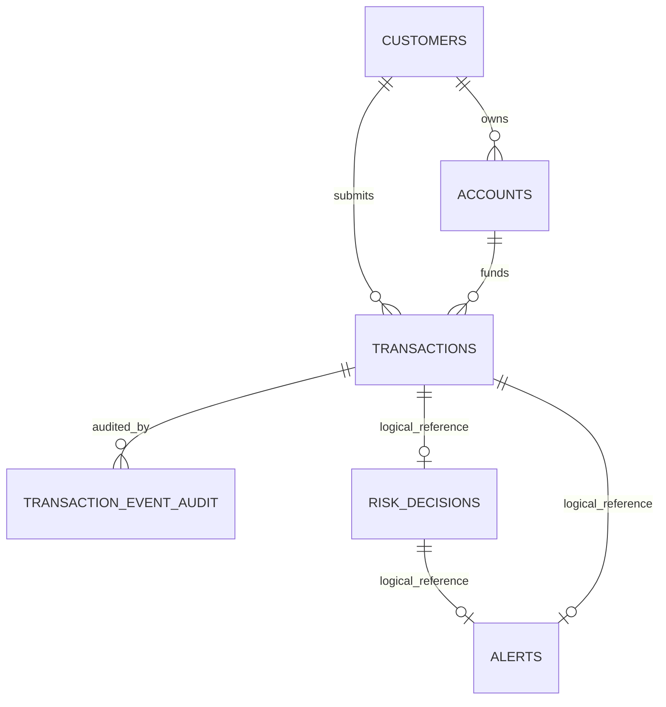

# Database Tables

This project uses PostgreSQL with Flyway migrations. The services are event-driven and own their own tables, even when they currently run against the same database.

Cross-service IDs such as `transaction_id`, `customer_id`, `account_id`, and `risk_decision_id` are logical references copied through Kafka events unless a foreign key is explicitly listed below.

## Service Ownership

| Service | Owned tables |
| --- | --- |
| `transaction-ingestion-service` | `customers`, `accounts`, `transactions`, `outbox_events`, `transaction_event_audit` |
| `risk-engine-service` | `risk_rules`, `risk_decisions`, `risk_outbox_events` |
| `alert-service` | `alerts` |

## Relationship Summary

Only these relationships are enforced with database foreign keys:

- `accounts.customer_id -> customers.id`
- `transactions.customer_id -> customers.id`
- `transactions.account_id -> accounts.id`
- `transaction_event_audit.transaction_id -> transactions.id`

Risk and alert tables intentionally do not use foreign keys back to ingestion tables. They are connected by Kafka events and application-level IDs.

## Transaction Ingestion Tables

Source migration:
`services/transaction-ingestion-service/src/main/resources/db/migration/V1__init_schema.sql`

### `customers`

Stores customer records used during transaction validation.

| Column | Type | Notes |
| --- | --- | --- |
| `id` | `UUID` | Primary key |
| `external_customer_id` | `VARCHAR(100)` | Unique external/customer-facing ID |
| `full_name` | `VARCHAR(200)` | Required |
| `email` | `VARCHAR(200)` | Optional |
| `phone_number` | `VARCHAR(50)` | Optional |
| `status` | `VARCHAR(30)` | `ACTIVE`, `INACTIVE`, `BLOCKED`; defaults to `ACTIVE` |
| `created_at` | `TIMESTAMPTZ` | Defaults to `NOW()` |
| `updated_at` | `TIMESTAMPTZ` | Defaults to `NOW()` |

Indexes:

- `idx_customers_external_customer_id`

### `accounts`

Stores customer accounts used during transaction validation.

| Column | Type | Notes |
| --- | --- | --- |
| `id` | `UUID` | Primary key |
| `customer_id` | `UUID` | Foreign key to `customers.id` |
| `external_account_id` | `VARCHAR(100)` | Unique external/account-facing ID |
| `account_type` | `VARCHAR(30)` | `CHECKING`, `SAVINGS`, `CREDIT_CARD`, `LOAN` |
| `account_status` | `VARCHAR(30)` | `ACTIVE`, `INACTIVE`, `FROZEN`, `CLOSED`; defaults to `ACTIVE` |
| `currency` | `VARCHAR(3)` | Defaults to `USD` |
| `current_balance` | `NUMERIC(19,4)` | Defaults to `0` |
| `created_at` | `TIMESTAMPTZ` | Defaults to `NOW()` |
| `updated_at` | `TIMESTAMPTZ` | Defaults to `NOW()` |

Indexes:

- `idx_accounts_customer_id`
- `idx_accounts_external_account_id`

### `transactions`

Stores submitted transactions after customer/account validation.

| Column | Type | Notes |
| --- | --- | --- |
| `id` | `UUID` | Primary key |
| `transaction_reference` | `VARCHAR(100)` | Unique transaction reference |
| `idempotency_key` | `VARCHAR(150)` | Unique request idempotency key |
| `customer_id` | `UUID` | Foreign key to `customers.id` |
| `account_id` | `UUID` | Foreign key to `accounts.id` |
| `transaction_type` | `VARCHAR(40)` | `PURCHASE`, `TRANSFER`, `WITHDRAWAL`, `DEPOSIT`, `PAYMENT` |
| `payment_channel` | `VARCHAR(40)` | `CARD`, `ACH`, `WIRE`, `ATM`, `ONLINE_BANKING`, `MOBILE_APP` |
| `amount` | `NUMERIC(19,4)` | Must be greater than `0` |
| `currency` | `VARCHAR(3)` | Defaults to `USD` |
| `merchant_name` | `VARCHAR(200)` | Optional |
| `merchant_category` | `VARCHAR(100)` | Optional |
| `merchant_country` | `VARCHAR(3)` | Optional |
| `source_ip` | `VARCHAR(100)` | Optional |
| `device_id` | `VARCHAR(150)` | Optional |
| `transaction_status` | `VARCHAR(40)` | `RECEIVED`, `PUBLISHED`, `PROCESSING`, `COMPLETED`, `FAILED`; defaults to `RECEIVED` |
| `transaction_time` | `TIMESTAMPTZ` | Transaction occurrence time |
| `created_at` | `TIMESTAMPTZ` | Defaults to `NOW()` |
| `updated_at` | `TIMESTAMPTZ` | Defaults to `NOW()` |

Indexes:

- `idx_transactions_customer_id`
- `idx_transactions_account_id`
- `idx_transactions_transaction_time`
- `idx_transactions_status`
- `idx_transactions_customer_time`

### `outbox_events`

Transaction-ingestion outbox for publishing transaction events to Kafka.

| Column | Type | Notes |
| --- | --- | --- |
| `id` | `UUID` | Primary key |
| `aggregate_type` | `VARCHAR(100)` | Aggregate name/type |
| `aggregate_id` | `UUID` | Usually the transaction ID |
| `event_type` | `VARCHAR(100)` | Example: `TransactionReceived` |
| `topic_name` | `VARCHAR(150)` | Kafka topic |
| `payload` | `JSONB` | Event payload |
| `event_status` | `VARCHAR(30)` | `PENDING`, `PUBLISHED`, `FAILED`; defaults to `PENDING` |
| `retry_count` | `INT` | Defaults to `0` |
| `last_error` | `TEXT` | Last publish failure, if any |
| `created_at` | `TIMESTAMPTZ` | Defaults to `NOW()` |
| `published_at` | `TIMESTAMPTZ` | Set after successful publish |

Indexes:

- `idx_outbox_events_status_created_at`

### `transaction_event_audit`

Audits consumed transaction events inside the ingestion service.

| Column | Type | Notes |
| --- | --- | --- |
| `id` | `UUID` | Primary key |
| `event_id` | `UUID` | Event ID from payload |
| `transaction_id` | `UUID` | Foreign key to `transactions.id` |
| `topic_name` | `VARCHAR(150)` | Kafka topic |
| `event_type` | `VARCHAR(100)` | Event type |
| `consumer_name` | `VARCHAR(100)` | Consumer name |
| `processing_status` | `VARCHAR(30)` | `RECEIVED`, `PROCESSED`, `FAILED` |
| `error_message` | `TEXT` | Optional failure details |
| `received_at` | `TIMESTAMPTZ` | Defaults to `NOW()` |
| `processed_at` | `TIMESTAMPTZ` | Set when processed |

Indexes:

- `idx_transaction_event_audit_transaction_id`

## Risk Engine Tables

Sources:

- `services/risk-engine-service/src/main/resources/db/migration/V1__init_risk_engine_schema.sql`
- `services/risk-engine-service/src/main/resources/db/migration/V3__create_risk_outbox_events.sql`

### `risk_rules`

Stores configurable risk rules and scoring impact.

| Column | Type | Notes |
| --- | --- | --- |
| `id` | `UUID` | Primary key |
| `rule_code` | `VARCHAR(100)` | Unique rule identifier |
| `rule_name` | `VARCHAR(200)` | Display name |
| `rule_description` | `TEXT` | Rule description |
| `rule_type` | `VARCHAR(50)` | `AMOUNT`, `PAYMENT_CHANNEL`, `LOCATION`, `MERCHANT_CATEGORY`, `DEVICE`, `COMPOSITE` |
| `score_impact` | `INT` | 0 through 100 |
| `active` | `BOOLEAN` | Defaults to `TRUE` |
| `created_at` | `TIMESTAMPTZ` | Defaults to `NOW()` |
| `updated_at` | `TIMESTAMPTZ` | Defaults to `NOW()` |

Indexes:

- `idx_risk_rules_active`
- `idx_risk_rules_rule_type`

### `risk_decisions`

Stores the risk evaluation result for each transaction event.

| Column | Type | Notes |
| --- | --- | --- |
| `id` | `UUID` | Primary key |
| `transaction_id` | `UUID` | Unique logical reference to transaction |
| `transaction_reference` | `VARCHAR(100)` | Transaction reference copied from event |
| `customer_id` | `UUID` | Logical reference copied from event |
| `account_id` | `UUID` | Logical reference copied from event |
| `risk_score` | `INT` | 0 through 100 |
| `risk_level` | `VARCHAR(30)` | `LOW`, `MEDIUM`, `HIGH`, `CRITICAL` |
| `decision_status` | `VARCHAR(50)` | `APPROVED`, `MONITOR`, `REVIEW_REQUIRED`, `BLOCK_RECOMMENDED` |
| `decision_reason` | `TEXT` | Human-readable explanation |
| `triggered_rules` | `JSONB` | Rule results that contributed to the score |
| `evaluated_at` | `TIMESTAMPTZ` | Defaults to `NOW()` |
| `created_at` | `TIMESTAMPTZ` | Defaults to `NOW()` |

Indexes:

- `idx_risk_decisions_transaction_reference`
- `idx_risk_decisions_customer_id`
- `idx_risk_decisions_account_id`
- `idx_risk_decisions_risk_level`
- `idx_risk_decisions_decision_status`
- `idx_risk_decisions_evaluated_at`
- `idx_risk_decisions_customer_evaluated_at`

### `risk_outbox_events`

Risk-engine outbox for publishing risk-evaluated events to Kafka.

| Column | Type | Notes |
| --- | --- | --- |
| `id` | `UUID` | Primary key |
| `aggregate_type` | `VARCHAR(100)` | Aggregate name/type |
| `aggregate_id` | `UUID` | Usually the risk decision ID or transaction ID depending on event construction |
| `event_type` | `VARCHAR(100)` | Risk event type |
| `topic_name` | `VARCHAR(150)` | Kafka topic |
| `payload` | `JSONB` | Event payload |
| `event_status` | `VARCHAR(30)` | `PENDING`, `PUBLISHED`, `FAILED`; defaults to `PENDING` |
| `retry_count` | `INT` | Defaults to `0` |
| `last_error` | `TEXT` | Last publish failure, if any |
| `created_at` | `TIMESTAMPTZ` | Defaults to `NOW()` |
| `published_at` | `TIMESTAMPTZ` | Set after successful publish |

Indexes:

- `idx_risk_outbox_events_status_created_at`

## Alert Tables

Source migration:
`services/alert-service/src/main/resources/db/migration/V1__init_alert_schema.sql`

### `alerts`

Stores operational alerts generated from high-risk risk decisions.

| Column | Type | Notes |
| --- | --- | --- |
| `id` | `UUID` | Primary key |
| `alert_reference` | `VARCHAR(100)` | Unique alert reference |
| `transaction_id` | `UUID` | Unique logical reference to transaction |
| `transaction_reference` | `VARCHAR(100)` | Transaction reference copied from event |
| `risk_decision_id` | `UUID` | Logical reference to risk decision |
| `customer_id` | `UUID` | Logical reference copied from event |
| `account_id` | `UUID` | Logical reference copied from event |
| `risk_score` | `INT` | 0 through 100 |
| `risk_level` | `VARCHAR(30)` | `LOW`, `MEDIUM`, `HIGH`, `CRITICAL` |
| `decision_status` | `VARCHAR(50)` | `APPROVED`, `MONITOR`, `REVIEW_REQUIRED`, `BLOCK_RECOMMENDED` |
| `alert_status` | `VARCHAR(40)` | `OPEN`, `IN_REVIEW`, `ESCALATED`, `CLOSED`, `FALSE_POSITIVE`; defaults to `OPEN` |
| `alert_priority` | `VARCHAR(40)` | `LOW`, `MEDIUM`, `HIGH`, `CRITICAL` |
| `alert_reason` | `TEXT` | Human-readable alert reason |
| `triggered_rules` | `JSONB` | Rules copied from risk event |
| `assigned_to` | `VARCHAR(150)` | Optional analyst assignment |
| `created_at` | `TIMESTAMPTZ` | Defaults to `NOW()` |
| `updated_at` | `TIMESTAMPTZ` | Defaults to `NOW()` |
| `closed_at` | `TIMESTAMPTZ` | Set when closed or marked false positive |

Indexes:

- `idx_alerts_transaction_id`
- `idx_alerts_risk_decision_id`
- `idx_alerts_customer_id`
- `idx_alerts_account_id`
- `idx_alerts_risk_level`
- `idx_alerts_decision_status`
- `idx_alerts_alert_status`
- `idx_alerts_alert_priority`
- `idx_alerts_created_at`
- `idx_alerts_status_priority_created`

## Event-Driven Consistency Notes

The ingestion service is the source of truth for customers, accounts, and transactions.

The risk-engine service receives transaction data from Kafka and stores a risk decision with copied transaction, customer, and account IDs. The alert service receives risk data from Kafka and stores alert rows with copied transaction, risk decision, customer, and account IDs.

This means:

- Cross-service references are query/navigation identifiers, not enforced foreign keys.
- Each service can evolve its schema independently.
- Duplicate protection is handled through unique IDs such as `transactions.idempotency_key`, `risk_decisions.transaction_id`, and `alerts.transaction_id`.
